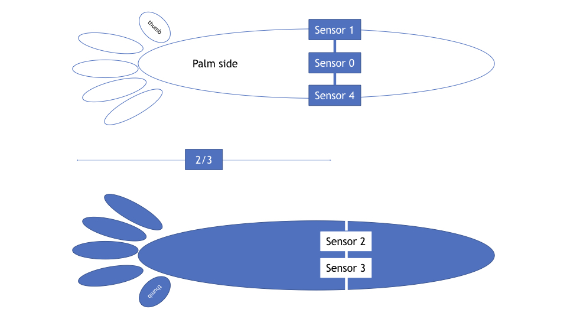

# Project Overview
Our project is a pre-processing procedure to better actuate a prosthetic arm using muscle signals from the forearm of a patient with the use of Surface Electromyography (sEMG) sensors. Our work experiments with wavelet transform theory as a means of pre-processing for sEMG signals. By first performing a wavelet transform on the sEMG signals, we found that we can greatly improve classifier accuracy to gain more performance from the typically noisy sEMG data.

Project Code: https://github.com/ak5793/sEMG_Project?fbclid=IwAR1nLIOApMsEyWNIJAxGn_dTvarZVTDT_1wqg5STcA0DmPBEtePxYEV8C9M

## Real World Applications

We wouldlike to setup a system that can provide accurate classification results from the muscle signals in real time. This would benefit many prostheses applications as well as diagnostics on muscle related disorders.

Our biggest desire after real-time functionality is to expand our testing to more hand motions to see how the wavelet transform affects the classification of a more varied data set. Since the same arm muscle can receive many different actuation signals to perform the variety of motions our hands achieve, it would be interesting to see how well our algorithm can still classify motions that activate similar muscle groups. The other change we would like to try is experimenting with the positioning and quantity of the sEMG Sensors. While we used a ring around the muscle region we knew would be very active, we believe with more research or the assistance of a medical professional we can optimize sensor placement to use less noise sensitive locations that still provide us with the readings we need.

### Circuit Diagram

### Collecting Data from Front Arm

### Closed Fist Signal

### Open Palm Signal

### Sensor Places

## Analysis
Using Discrete wavelet transform and the Daubechies Double Tap mother wavelet allowed us to improve the accuracy for 4 out of the 7 classifiers that we used. Overall we noticed that the classifiers that were most improved by first performing the Wavelet transform before training were the classifiers that initially performed the worst. Adding the extra step went as far as doubling or even quadrupling what started off as relatively poor performing classifiers. We believe that these methods initially performed so poorly because these classifiers have tendency to overfit. When some noise enters the signal, the classifier's try to fit these points as well which decreases the accuracy. By first breaking the signals down to their wavelet transform coefficients, the data became more clean because of its de-noising nature and its ability to make more defining characteristics of the grasp signal more prominent after the transform.

